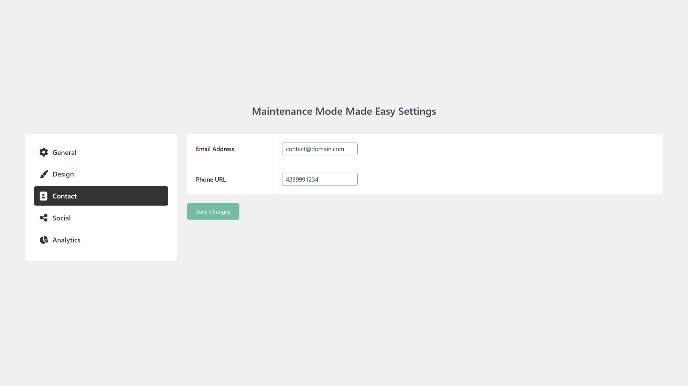

## Description

Easily manage your site’s maintenance mode with **Maintenance Mode Made Easy**, a lightweight and user-friendly WordPress plugin. Designed to give you full control while keeping things simple, this plugin ensures your site’s downtime is professional and hassle-free.

### Features

- Enable or disable maintenance mode effortlessly from the WordPress admin bar, no complicated settings required.
- Automatically sends a **503 HTTP status header** to inform search engines your site is temporarily unavailable, preserving your SEO rankings.
- Personalize the **heading**, **message**, **color**, **background color**, **background color opacity** (can also overlay background images), and **background image** displayed on the maintenance page to match your site’s tone and brand.
- Add **contact icons** for users to reach you during maintenance.
- Add **social icons** with links to your social media pages.
- Select **additional roles** that can bypass maintenance mode.
- Track maintenance page visits seamlessly with built-in **Google Analytics** & **Matomo** integration, which also checks for the [Complianz](https://wordpress.org/plugins/complianz-gdpr/) "cmplz_statistics" cookie before tracking.
- Blocks new **WooCommerce orders** during maintenance mode to prevent additional orders from being processed via AJAX.
- Build your own **custom maintenance page** by creating a new `maintenance.php` in your active theme folder and selecting the "Custom" template in the settings.
- If a **Privacy Policy** is defined in `/wp-admin/options-privacy.php`, it will allow users to access this page when the site is in maintenance mode.

### Roadmap

- Start / End Date & Time
- Add EDD check
- Add preview button in backend
- Pull Yoast title and description and append "Under Maintenance" to it
- Design and build additional templates
- Add a builder
- Redesign of settings page

### GDPR

> **Disclaimer**: We are not lawyers and always recommend doing your own compliance research into third-party plugins, libraries, etc., as we've seen other maintenance plugins not be in compliance with these regulations.

This plugin uses **Bootstrap**, **Bootstrap Icons**, and **Select2** third-party libraries. These libraries are loaded locally to be compliant with data protection regulations.

This plugin has the capability to use **Google Analytics** and **Matomo**. If you enable this option, please ensure you are in compliance with data processing regulations. We currently have checks for the [Complianz](https://wordpress.org/plugins/complianz-gdpr/) "cmplz_statistics" cookie before tracking, but if you do not use Complianz, you will need to build your own integration. You can also submit a [feature request](https://www.polyplugins.com/contact/) for the compliance plugin you use, and we'll look into integrating it.

This plugin collects and stores certain data on your server to ensure proper functionality, including:

- Storing plugin settings
- Remembering which notices have been dismissed

### Assets

- [Under Construction Keyboard](https://www.pexels.com/photo/under-construction-signage-on-laptop-keyboard-211122/)

## Screenshots

1. 
2. 
3. 
4. 
5. 
6. 

## Installation

1. Backup WordPress
2. Upload the plugin files to the `/wp-content/plugins/` directory, or install the plugin through the WordPress plugins screen directly
3. Activate the plugin through the 'Plugins' screen in WordPress
4. Click the **Maintenance Mode** item in the admin bar to configure the plugin

## Changelog

### 1.0.6
- **Added**: Translation capabilities

### 1.0.5
- **Bugfix**: Cache causing error when maintenance mode is disabled

### 1.0.4
- **Added**: Setting for additional roles to bypass Maintenance Mode
- **Added**: Bootstrap Icons
- **Updated**: Default options
- **Updated**: Top bar to also be green on frontend when in Maintenance Mode
- **Removed**: Font Awesome
- **Bugfix**: Setting menu styling
- **Optimization**: Refactored codebase

### 1.0.3
- **Bugfix**: Contact icons not linking correctly
- **Bugfix**: Contact icons not spaced properly

### 1.0.2
- **Added**: WYSIWYG editor for content section
- **Added**: Contact section to admin to allow adding email and phone icons to maintenance page
- **Added**: Socials section to admin to allow adding social icons to maintenance page
- **Bugfix**: Icons not loading in admin

### 1.0.1
- **Bugfix**: Admins not able to bypass maintenance order restrictions when performing test orders

### 1.0.0
- Initial Release